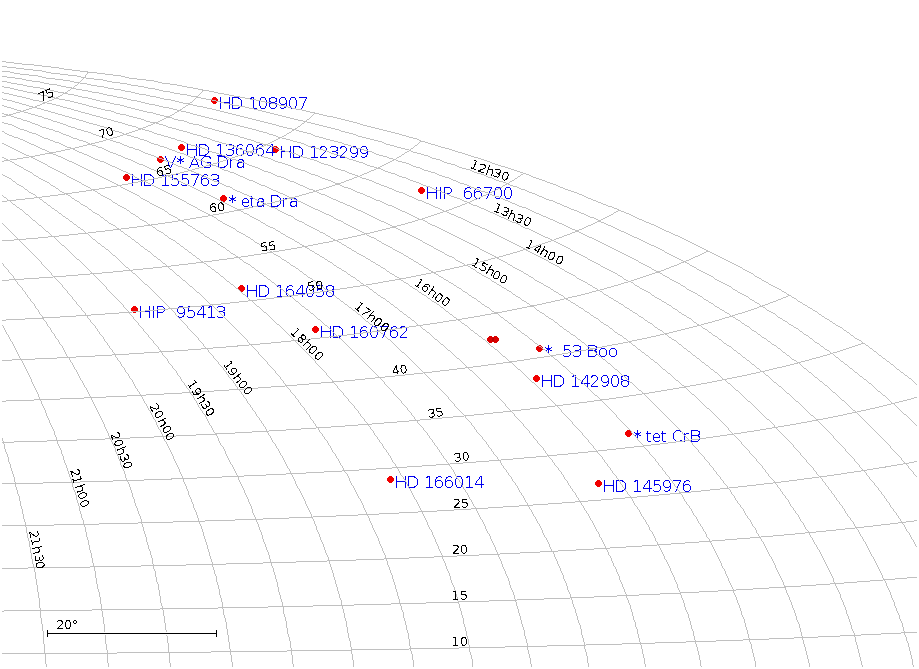

Handy Queries
=============

.. role:: red

This project is proceeding from two points of view:

1. Integrate the spectral libraries from astronomical projects.
2. Take in spectra from large and small telescope programs.

Given
-----

The observing plan as star names. The names were matched to
RA/DEC via TOPCAT and a SIMBAD query using the **ident** table
to get the **oidref = oid**, then the **main** table to get
the RA/DEC and other related information. Figure "Target list"
shows the cluster of targets.

.. _rawobs:

   Target list for 5 May, 2020 England.

The first letter in FITS is flexible, and to that end it is necessary
to bring in the standard star **FITS** files headers. The vocabulary
of the originating observatories and small telescope observers
differ. Databases require exact matches, and to these ends require
a process to assure data integrity and referential integrity. The
astrometric positions are not precise, and 'neighborhood' (cone)
are required. Target names have various assumptions built in: e.g.:
occasional use of two spaces rather than one. While the brain
can accommodate the difference -- machines trip over the mis-step.

Astropy was used to open files, iterate over one or more HDUs (Header
Data Unit) consists of **'CARDS'** with a keyword, value and optional
comment. The HDU is scanned and converted into a Python dictionary by
the 'fits2psqlraw' python tool. The JSON keyword is the FITS keyword,
the JSON value field is an embedded dictionary with the 'value' and
'comment' part. The 'fits2psqlraw' python tool produces output to
'stdout' (redirect to a file) and is loaded into PostgreSQL as a 'raw'
file. The 'raw' file can be accessed (think Materialized View) to
transliterate the observatory into the database's vocabulary.

Example SELECT statement
------------------------

Here external functions **r2s** and **d2s** are used to convert decimal
RA and decimal Dec to traditional sexigesimal notation.  The
*quote_literal* places tick-marks around the text for clarity
and possible use later on in the process. The header is
declared to be a **jsonb** (binary json) field; the **->**
operator brings out fields and the **->>** operator renders
them into text form.

Note: This is from the NGSL original files, where the "OBJECT"
is called "TARGOBJ" etc.

.. code-block:: psql
   :linenos:

   select target, r2s(ora) as "RA", d2s(odec) as "DEC",
          quote_literal(header -> 'HDU[0]' -> 'GRATING' ->> 'value') as "Grating",
          quote_literal(header -> 'HDU[0]' -> 'SPECTYPE' ->> 'value') as "SpType"
   from rawngslheaders
   where header -> 'HDU[0]' -> 'SPECTYPE' ->> 'value' = 'composite'
   order by ora::integer/15,odec
   ;

A Python function useful to pretty print JSON entries:

.. code-block:: psql
   :linenos:

   CREATE FUNCTION pp_json(j JSON, sort_keys BOOLEAN = TRUE, indent TEXT = '    ')
   RETURNS TEXT AS $$
     import simplejson as json
     return json.dumps(json.loads(j), sort_keys=sort_keys, indent=indent)
   $$ LANGUAGE PLPYTHONU;

Summary
-------

This page will be expanded to include more examples of
queries suited to the task.

SIMBAD
++++++

Given a list of target names, not necessarily the SIMBAD **mainid** names,
locate them and dig out the salient data for the bigger database. This
produces a **.raw** file. The main **basic** table has a **iod**, other
tables link to this using the field name **oidref**. In the case of the
**ident** table, multiple star names are tied to one **oidref**, which
ties back to the other tables. It is possible to move between the
tables using just the **oidref**.  Here ident is used to match the
given target name from observer, allfluxes digs out the flux values,
and basic provides the RA,DEC,spectral type and qualifier.

First the target names are entered into a simple database, using a
simple Comma-Separated-Value file. All that is needed is one column
with target names that match alternate names within SIMBAD. SIMBAD is
pretty liberal with the star names, misspellings (this example
Betelgeuse is misspelled) but some planetarium vendors alter star names
up with their own decisions. Leading zeros may be omitted when SIMBAD
requires them and minus signs are changed to colons or worse. Latex
tends to use typesetting characters in lieu of the ASCII used within
SIMBAD.

.. code-block:: psql
   :linenos:

   SELECT  ident.oidref, ident.id, basic.otype_txt,
           basic.ra, basic.dec, basic.sp_type, basic.sp_qual,
           allfluxes.*, alltypes.*
   FROM ident, TAP_UPLOAD.giventargets
   join allfluxes on   ident.oidref = allfluxes.oidref
   join alltypes  on   ident.oidref = alltypes.oidref
   join basic     on   ident.oidref = basic.oid
   where giventargets.starname = ident.id;
   ;

.. code-block:: psql
   :linenos:
   
   select b.id as "Given Target",
          header -> 'TARGNAME' ->> 'value' as "NGSLNAME",
          fqpname,r2s(b.ora)  as "RA",
          d2s(b.odec) as "DEC"
   
   from stis           a
   join rawgiventargets b
   on q3c_join(a.ora,a.odec, b.ora,b.odec, 10.0)
   order by (b.ora::int)/15, b.odec
   ;

.. code-block:: psql
   :linenos:

Some fields overlap, so another basic select is in order.
Note: The **header** field is a **jsonb**, taken verbatim
from the header of the original file. Thus the **OBJECT** field
is **TARGNAME** in this case. The compound select statement:

.. code-block:: psql
   :linenos:

   SELECT DISTINCT fqpname FROM (
      SELECT b.id AS "Given Target",
             header -> 'TARGNAME' ->> 'value' AS "NGSLNAME",
             fqpname,r2s(b.ora)               AS "RA",
             d2s(b.odec)                      AS "DEC"
      
      FROM stis           a
      JOIN rawtonytargets b
      ON q3c_join(a.ora,a.odec, b.ora,b.odec, 10.0)
      ORDER BY (b.ora::int)/15, b.odec ) xx
   ;

.. code-block:: psql
   :linenos:

   SELECT DISTINCT "NGSLNAME", "TargName", fqpname, "RA", "DEC", "VMag", "SPType" , "SPQual" FROM (
      SELECT b.id                             AS "Given Target",
             b.v::numeric(7,3)                AS "VMag",
             b.sp_type                        AS "SPType",
             b.sp_qual                        AS "SPQual",
             b.id                             AS "TargName",
             header -> 'TARGNAME' ->> 'value' AS "NGSLNAME",
             fqpname,r2s(b.ora)               AS "RA",
             d2s(b.odec)                      AS "DEC"
      
      FROM stis           a
      JOIN rawtonytargets b
      ON q3c_join(a.ora,a.odec, b.ora,b.odec, 10.0)
      ORDER BY (b.ora::int)/15, b.odec ) xx

   ;

.. code-block:: psql
   :linenos:

\! sudo rm  /tmp/tonycsv.csv
COPY (

   SELECT DISTINCT "TargName", "REF_NAME", fqpname,
                   "REF_RA", "REF_DEC", "VMag",
                   "SPType" , "SPQual"
   FROM (
      SELECT b.id                             AS "Given Target",
             b.v::numeric(7,3)                AS "VMag",
             b.sp_type                        AS "SPType",
             b.sp_qual                        AS "SPQual",
             b.id                             AS "TargName",
             header -> 'TARGNAME' ->> 'value' AS "REF_NAME",
             fqpname,r2s(b.ora)               AS "REF_RA",
             d2s(b.odec)                      AS "REF_DEC"
      
      FROM stis           a
      JOIN rawtonytargets b
      ON q3c_join(a.ora,a.odec, b.ora,b.odec, 10.0)
      ORDER BY "TargName",(b.ora::int)/15, b.odec
      ) xx
   -- limit 10
    )
    TO '/tmp/tonycsv.csv' WITH CSV HEADER DELIMITER ','
    ;

.. raw:: latex

    \newpage

The original list from a email was used to produce, by hand and editor
a simple list. The gratitious column about the payload was added. This
is then **Load -> table** **database** into TOPCAT extended with the
proper jdbc package. PostgreSQL is used:

.. code-block:: psql
   :linenos:

   DROP TABLE    IF EXISTS giventargets;
   DROP SEQUENCE IF EXISTS giventargets_sequence;
   CREATE SEQUENCE         giventargets_sequence START 100000;
   
   CREATE TABLE giventargets (
      uniqueid  integer PRIMARY KEY DEFAULT nextval('giventargets_sequence'),
      starname  text,
      program   text
   );

   insert into giventargets (starname,program ) values
      ('HD123299'       ,  'Lowspec3 Miles' ),
      ('HD142373'       ,  'Lowspec3 Miles' ),
      ('HD142908'       ,  'Lowspec3 Miles' ),
      ('HD155763'       ,  'Lowspec3 Miles' ),
      ('HD164058'       ,  'Lowspec3 Miles' ),
      ('HD160762'       ,  'Lowspec3 Miles' ),
      ('HIP 66700'      ,  'Lowspec3 target' ),
      ('HD 108907'      ,  'Lowspec3 target' ),
      ('HD 142926'      ,  'Lowspec3 target' ),
      ('HD 138629'      ,  'Lowspec3 target' ),
      ('HIP 95413'      ,  'Lowspec3 target' ),
      ('HD 166014'      ,  'Lowspec3 target' ),
      ('HD145976'       ,  'UVEX3 Miles' ),
      ('HD038545'       ,  'UVEX3 Miles' ),
      ('HD142373'       ,  'UVEX3 Miles' ),
      ('HD142807'       ,  'UVEX3 Miles' ),
      ('4Her'           ,  'UVEX3 target' ),
      ('Betelgeuse'     ,  'UVEX3 target' ),
      ('Procyon'        ,  'UVEX3 target' ),
      ('tetCrB'         ,  'UVEX3 target' ),
      ('HD155763'       ,  'Tragos3 Miles' ),
      ('HD142373'       ,  'Tragos3 Miles' ),
      ('HD136064'       ,  'Tragos3 Miles' ),
      ('eta Dra'        ,  'Tragos3 target' ),
      ('4 Her'          ,  'Tragos3 target' ),
      ('53 Boo'         ,  'Tragos3 target' ),
      ('AGDra'          ,  'Tragos3 target' );
   

copy (select * from giventargets)
TO '/tmp/giventargets.csv'
WITH  CSV DELIMITER ',' HEADER;

This appears as a rather complicated name in the **Table list** of
TOPCAT. The table name can then be changed to something easy to type
for an **UPLOAD** key for joins using the TOPCAT TAP interface to the
SIMBAD service.

